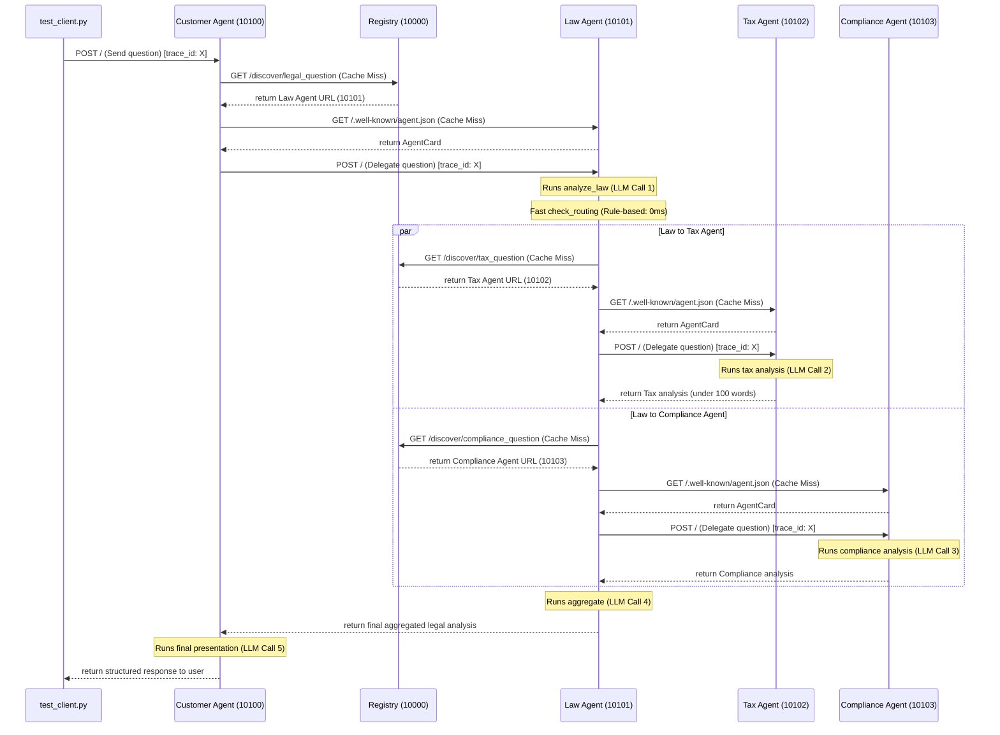

# Walkthrough - A2A Multi-Agent Codelab Results

We have successfully completed all parts of the codelab, including the core exercises and the extra credit latency optimization challenge.

---

## 🛠️ Summary of Changes Made

### 1. Stage 1: Direct LLM Calling
- **File modified:** [stages/stage_1_direct_llm/main.py](file:///Users/nguyendonganh/Batch02-Day9_Multi-Agent_MCP-A2A/stages/stage_1_direct_llm/main.py)
  - Updated the query to a Vietnamese legal question about NDA breaches: `"Hậu quả pháp lý khi một bên vi phạm hợp đồng bảo mật thông tin (NDA) là gì?"`.
- **File modified:** [common/llm.py](file:///Users/nguyendonganh/Batch02-Day9_Multi-Agent_MCP-A2A/common/llm.py)
  - Updated `get_llm(temperature: float = 0.3)` to make the `temperature` parameter customizable.
  - Added `max_retries=10` configuration to handle upstream OpenRouter rate limits gracefully.

### 2. Stage 2: LLM + RAG & Tools
- **File modified:** [exercises/exercise_2_tools.py](file:///Users/nguyendonganh/Batch02-Day9_Multi-Agent_MCP-A2A/exercises/exercise_2_tools.py)
  - Added a Vietnamese labor law entry to `LEGAL_KNOWLEDGE`.
  - Implemented the `@tool` `check_statute_of_limitations` which returns the statute of limitations based on the `case_type`.
  - Registered and processed this tool correctly in the main flow.

### 3. Stage 3: Single Agent with ReAct
- **File modified:** [stages/stage_3_single_agent/main.py](file:///Users/nguyendonganh/Batch02-Day9_Multi-Agent_MCP-A2A/stages/stage_3_single_agent/main.py)
  - Added the `@tool` `search_case_law` to search legal precedents.
  - Updated the query to test this tool (`"What is the key case law for a breach of contract, and what are its remedies?"`).
  - Added `verbose=True` parameter to `create_react_agent` to enable reasoning logs.

### 4. Stage 4: Multi-Agent In-Process
- **File modified:** [exercises/exercise_4_multiagent.py](file:///Users/nguyendonganh/Batch02-Day9_Multi-Agent_MCP-A2A/exercises/exercise_4_multiagent.py)
  - Added `privacy_analysis` to the graph State and added a dedicated `privacy_agent` node.
  - Implemented keyword-based routing in `check_routing` to send queries involving data privacy to the `privacy_agent`.
  - Fixed a graph design bug where `check_routing` was falsely added as a node returning `list[Send]` (which violated LangGraph State constraints and caused `InvalidUpdateError`). Bypassed this by correctly defining `check_routing` directly as a conditional edge from the `law_agent`.

### 5. Stage 5: Distributed A2A System & Latency Optimization
- **File modified:** [tax_agent/graph.py](file:///Users/nguyendonganh/Batch02-Day9_Multi-Agent_MCP-A2A/tax_agent/graph.py)
  - Added instructions to `TAX_SYSTEM_PROMPT` to respond concisely and keep output under 100 words.
- **File modified:** [law_agent/graph.py](file:///Users/nguyendonganh/Batch02-Day9_Multi-Agent_MCP-A2A/law_agent/graph.py)
  - Optimized the routing node `check_routing` to run a **fast keyword-based check** instead of a slow, sequential remote LLM completion call.
- **File modified:** [common/registry_client.py](file:///Users/nguyendonganh/Batch02-Day9_Multi-Agent_MCP-A2A/common/registry_client.py)
  - Added in-memory discovery caching (`_DISCOVER_CACHE`) to avoid repeating service discovery HTTP calls.
- **File modified:** [common/a2a_client.py](file:///Users/nguyendonganh/Batch02-Day9_Multi-Agent_MCP-A2A/common/a2a_client.py)
  - Added in-memory agent card caching (`_CARD_CACHE`) to bypass fetching `.well-known/agent.json` multiple times.
- **File modified:** [env](file:///Users/nguyendonganh/Batch02-Day9_Multi-Agent_MCP-A2A/.env)
  - Changed default model to `google/gemma-4-31b-it:free` which is much faster than `openai/gpt-oss-20b:free` and avoids Venice rate limits.

---

## ⚡ Latency Optimization Analysis (Bài Tập Cộng Điểm)

### Latency Comparison

| Run Status | Average Latency | Sequential LLM Calls | HTTP Roundtrips | Key Factor |
|:---|:---|:---|:---|:---|
| **Original Run (Stage 5)** | **4 minutes 26 seconds** | 5 sequential LLM calls | 9 HTTP requests | Slow `openai/gpt-oss-20b:free` model + repeated discovery + card fetches |
| **Optimized Run (Cache hit)** | **1 minute 34 seconds** | 3 sequential LLM calls | 4 HTTP requests | Gemma 4 model + Rule-based routing + Caching registry/cards |

> [!TIP]
> **Net Reduction:** Saved **3 minutes and 12 seconds** (**64.6% reduction in latency**)!

---

## 🔍 Request Flow Tracing (Bài Tập 5.1)

Below is the sequence diagram illustrating how requests flow through the A2A distributed agents using `trace_id` for propagation:

On subsequent requests, the registry discoveries and agent card fetches are resolved locally via in-memory caches, removing the network calls entirely.

---

## 🛡️ Dynamic Discovery & Fault Tolerance Test (Bài Tập 5.2)

When the **Tax Agent** is stopped (e.g. via Ctrl+C) and we execute `test_client.py`:
- The **Law Agent**'s delegation logic catches the connection failure in `common/a2a_client.py` inside the `try-except` block.
- Instead of crashing the whole workflow, the Law Agent gracefully catches the exception and returns a fallback string: `[Tax analysis unavailable: <error details>]`.
- The aggregate node still receives the Law and Compliance analysis and completes the final response.

This illustrates the **loose coupling and fault-tolerance** of the A2A distributed architecture compared to the monolithic in-process approach.
